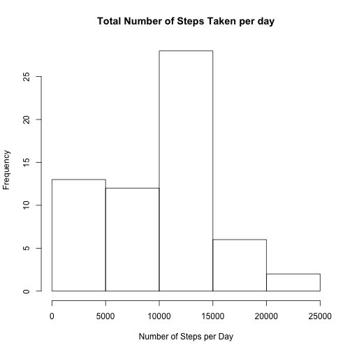
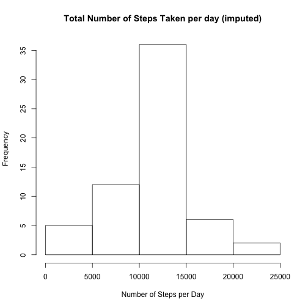
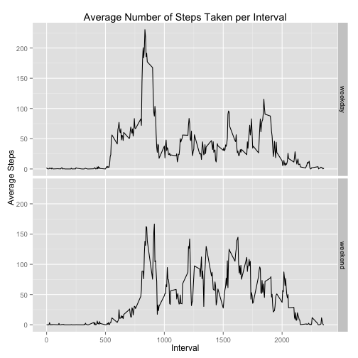

##Reproducible Research : Peer Assessment 1

```r
library(ggplot2)
```

##Data
###1. Loading the data

```r
activity <- read.csv("activity.csv")
```

##What is mean total number of steps taken per day ?

```r
stepsbyDay <- tapply(activity$steps,activity$date,sum,na.rm=TRUE)
```

###1. Make a histogram of the total number of steps taken each day.

```r
hist(stepsbyDay,xlab = "Number of Steps per Day",
     ylab= " Frequency",
     main ="Total Number of Steps Taken per day")
```

 
###2. Calculate and report the mean and median of the total number of steps taken each day.

```r
meansteps <- mean(stepsbyDay)
mediansteps <- median(stepsbyDay)
```

###3. What is the average daily activity pattern?

```r
tsSteps <- aggregate(steps ~ interval,data=activity, mean)
```
###4. Make a time series plot.

```r
si <- ggplot(tsSteps,aes(x=interval,y=steps)) + 
  geom_line() + 
  xlab("Interval") +
  ylab("Average Steps") +
  ggtitle("Average Number of Steps Taken per Interval")
print(si)
```

 

###5. Which 5-minute interval, on average across all the days in the dataset, contains the maximum number of steps?

```r
mostSteps <- which.max(tsSteps$meanSteps)
```

##Imputing Missing Values
###1. Calculate the total number of missing values in the data

```r
nMissing <- length(which(is.na(activity$steps)))
```
###2. Devise a strategy for filling in all of the missing values in the dataset.

###3. Create a new dataset that is equal to the original dataset but with the missing data filled in.


```r
activity2 <- activity
for (i in 1:dim(activity2)[1]){
  if (is.na(activity2[i,1])){
    int <- activity2[i,3]
    row <- which(tsSteps$interval == int)
    activity2[i,1] = tsSteps[row,2]
  }    
}
```

###4. Make a histogram of the total number of steps taken each day for imputed dataset.


```r
stepsbyDay2 <- tapply(activity2$steps,activity2$date,sum,na.rm=TRUE)
hist(stepsbyDay2,xlab = "Number of Steps per Day",
     ylab= " Frequency",
     main ="Total Number of Steps Taken per day (imputed)")
```

 
###5. Calculate and report the mean and median of the total number of steps taken each day for imputed data.

```r
meansteps2 <- mean(stepsbyDay2)
mediansteps2 <- median(stepsbyDay2)
```
##Are there differences in activity patterns between weekdays and weekends?
###1. Create a new factor variable in the dataset with two levels – “weekday” and “weekend” indicating whether a given date is a weekday or weekend day.

```r
activity2$daytype = weekdays (as.Date(activity2$date))
```

###2. Make a panel plot containing a time series plot

```r
for (i in 1:dim(activity2)[1]){
  if(activity2[i,4] %in% c("Saturday","Sunday")) {
    activity2[i,4] = "weekend"
  }
   else{
     activity2[i,4] = "weekday" 
   }
}
activity2$daytype <- as.factor(activity2$daytype)
tsSteps2 <-  aggregate(steps ~ interval + daytype, 
                       data=activity2, mean)
sp <- ggplot(tsSteps2,aes(x=interval,y=steps)) + 
  geom_line() +
  facet_grid(daytype ~ .) + 
  xlab("Interval") + 
  ylab("Average Steps") +
  ggtitle("Average Number of Steps Taken per Interval")
print(sp)
```

 
